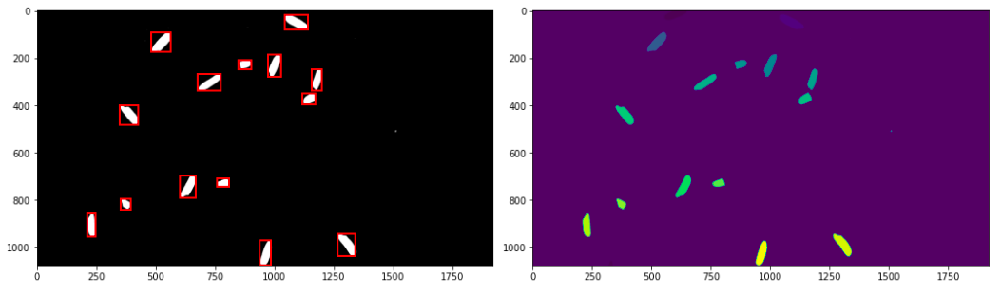
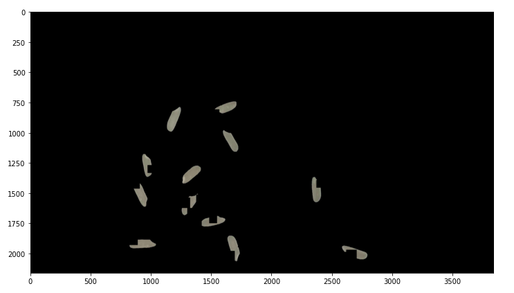

# yolov5_data_process
data process

这个是实验室要做谷物检测时，使用yolov5进行目标检测时，处理数据的代码。

- 将json文件转换成txt文件（labelme输出的是json文件）
- 使用skimage处理数据（由于使用传输带，所以谷物和背景很好分离，使用skiamge即可标注简单的目标框）

- 师兄写的转换代码，在ref文件夹
- 数据加强代码

